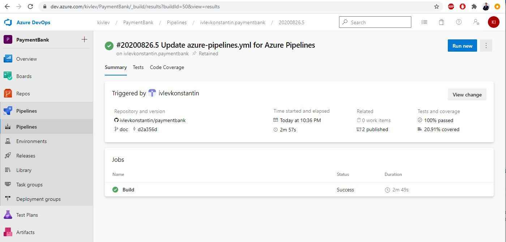
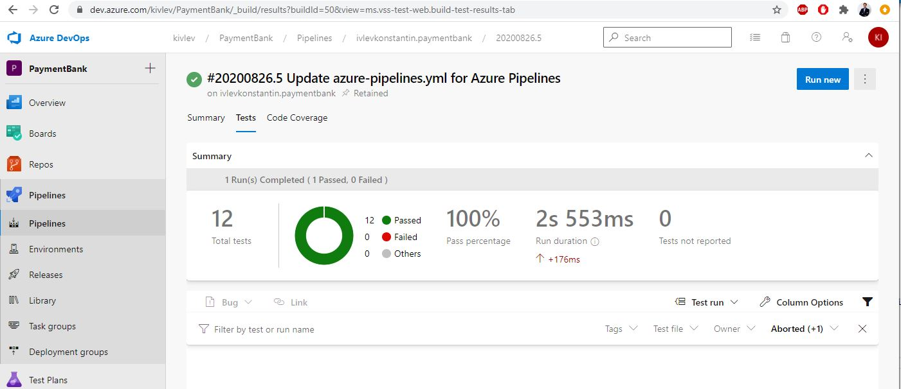
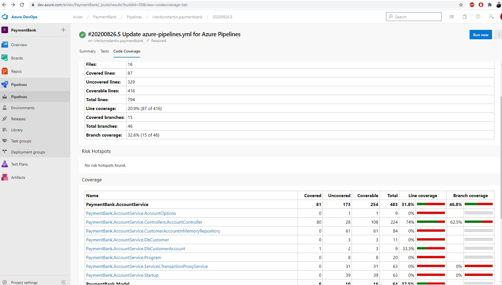
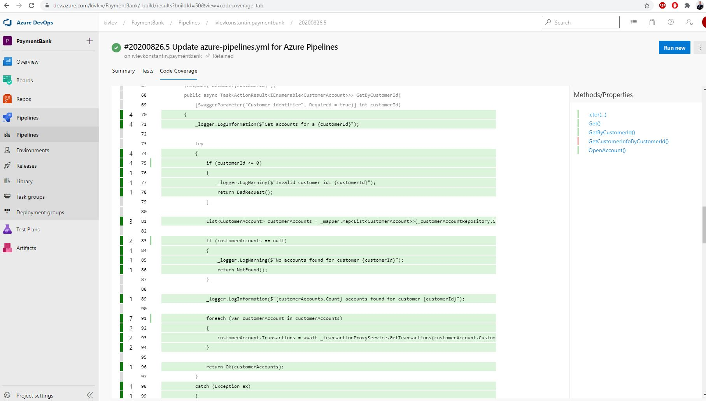
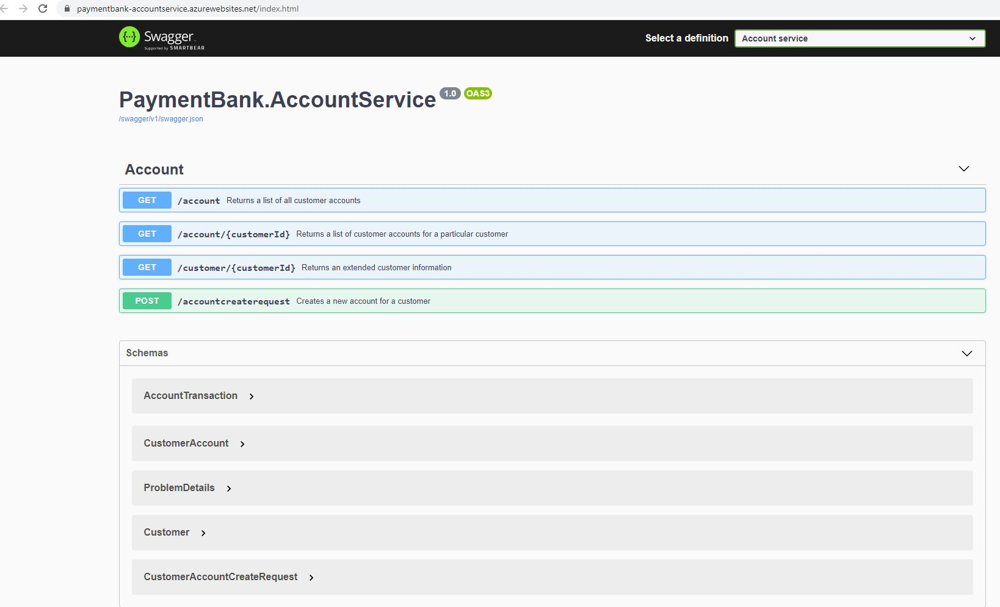
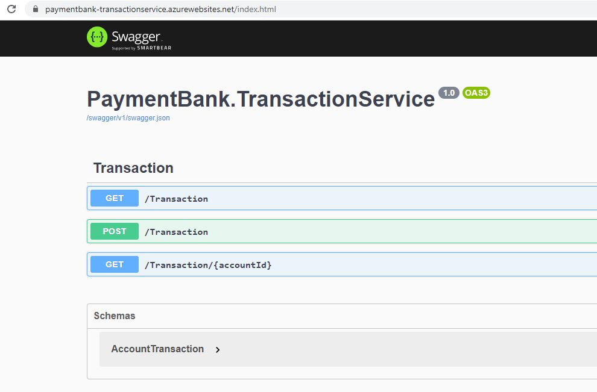
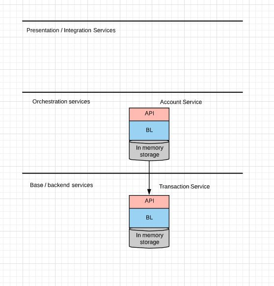

# Payment Bank API

## Functionality

### Public

Payment Bank API v1.0 supports a list of operations:
* retrieves a list of all customer accounts
* retrieves a list of all accounts for a particular customer
* retrieves an extended customer information
* creates a new account for a customer

### Private
Payment Bank API v1.0 for internal purposes supports a list of operations:
- retrieves a list of all transactions for all accounts
- creates a new transaction
- retrieves a list of all transactions for a specified account 

## CI/CD pipeline
### Continious integration
Azure Devops has been chosen for CI purposes. kivlev/PaymentBank project contains a single pipeline being triggered for any commit to any branch. The pipeline is in the root of the repository in the azure-pipelines.yml file.
The pipeline leverages Microsoft hosted agents to build, test, publish build artifacts and deploy activities.
Visual studio task for Azure Devops is used to build and pack both Account and Transaction services, and to build unit test project.
Unit tests are run by dotnet core task with trx output format. Code coverage is defined and collected in a cobertura format. *.trx file and *.cobertura.xml file are published as the pipeline artifacts.

Both of them are visible in any of pipeline execution panels:
</img>

The pipeline test panel gives an update regarding success rate of unit tests:
</img>

There is an extensive report for unit tests coverage on the Code Coverage blade. All the application classes are available for the detailed inspection.
</img>
</img>

### Continuous deployment
There are two deploy step defined at the end of the pipeline, which are triggered only for master branch. Every merge of Pull Request leads to a deployment of Account and Transaction services
to the corresponding Web Applications in Azure Dev Environment (Test/Acceptance/Production environments are not defined and not deployed yet for a sake of cost savings). Disclaimer: Web Applications are configured to use
Free Plan which limits their availability.

**Account service** is deployed to [link](https://paymentbank-accountservice.azurewebsites.net/index.html)
Swagger UI is configured and displayed at index.html page. Swagger UI could be used for manual testing purposes.
Disclaimer: full bank layout infrastructure is not available yet, that's why in memory storage is used as a data storage. The data storage is abstracted away and a usage of proper storage account, sql or nosql database could be added at any time without any major changes.
OpenAPI specification is available at [swagger.json](https://paymentbank-transactionservice.azurewebsites.net/swagger/v1/swagger.json) file.
</img>

**Transaction service** is deployed to [link](https://paymentbank-transactionservice.azurewebsites.net/index.html)
Swagger UI is configured and displayed at index.html page. Swagger UI could be used for manual testing purposes.
Disclamer: full bank layout infrastructure is not available yet, that's why in memory storage is used as a data storage.
OpenAPI specification is available at [swagger.json](https://paymentbank-transactionservice.azurewebsites.net/swagger/v1/swagger.json) file.
</img>

## Architecture

Sequence diagram could be found below:
</img>

Total microservice landscape:
</img>

## Roadmap

### Functional changes
* add ability to create new users
* enable authentication/authorization

### Non functionals
* clarify requirements and implement throttling
* provide a required level of High Availability
* implement disaster recovery strategy
* clarify and implement government regulations for audit
* implement integration/load/penetration testing

### Reduce Technical debt
* implement static code analysis, define quality gates and integrate checks into CI pipeline
* increase unit test coverage from 20% to 80%
* implement fluent validation/global error handling handlers
* move model to the separate repository and publish build artifacts
* split Account and Transaction services to different repositories
* use HttpClientFactory instead of creating HttpClient

### Further architecture considerations
* enable consistency and transaction support
* leverage API management

## Run locally
build&run.cmd file in the root of the repository builds the whole solution and runs both Account and Transaction services on ports 5000 and 5001 correspondingly (ports could be changed in launchsettings.json files).